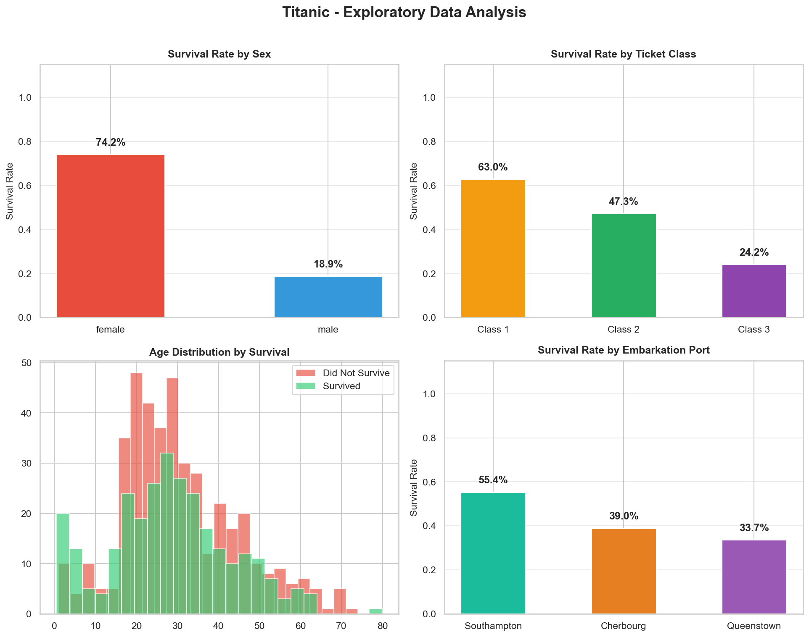
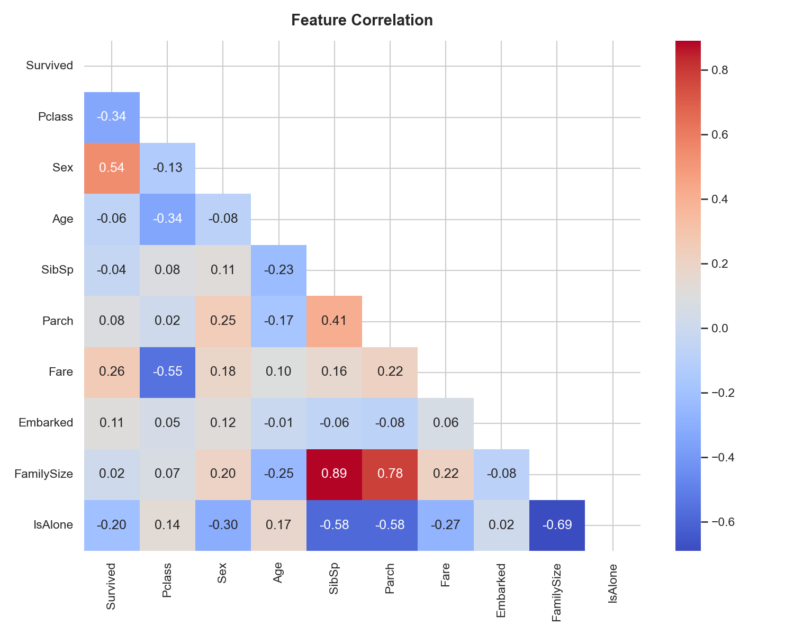
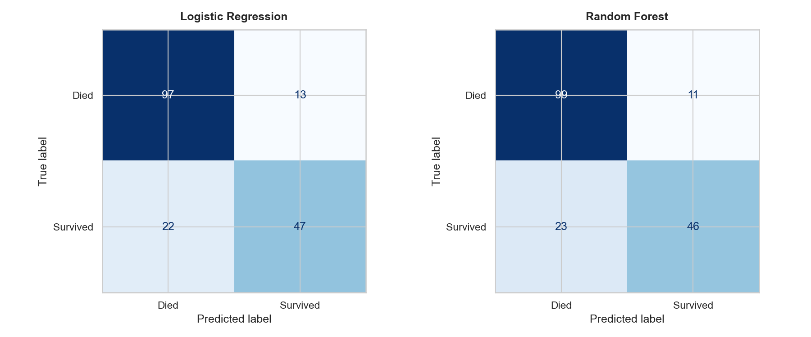
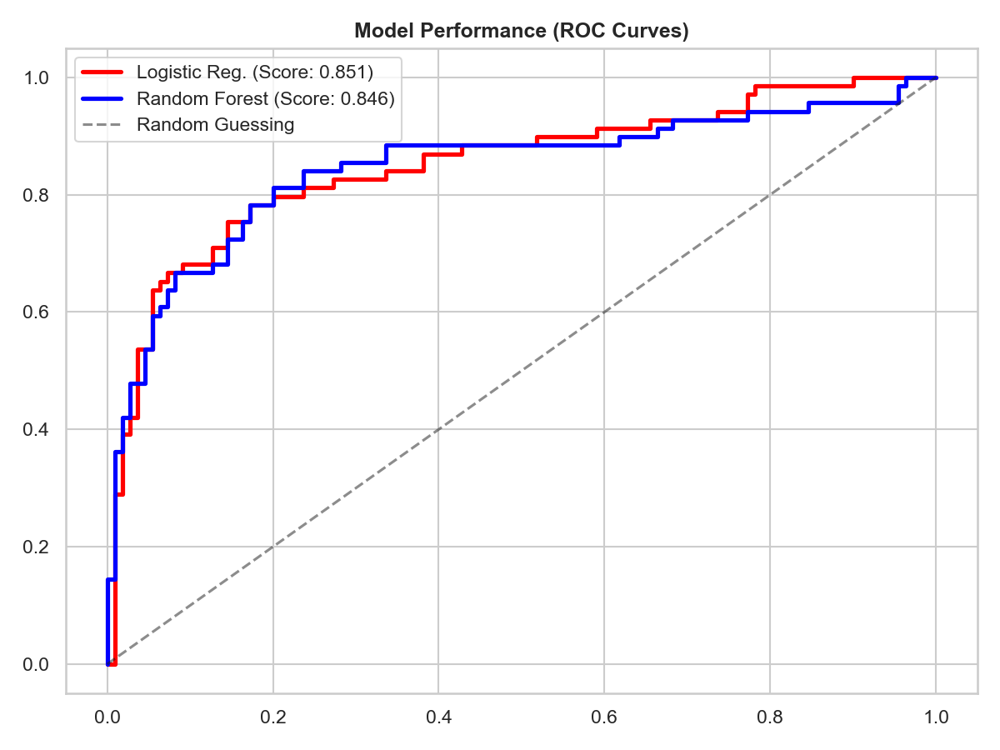
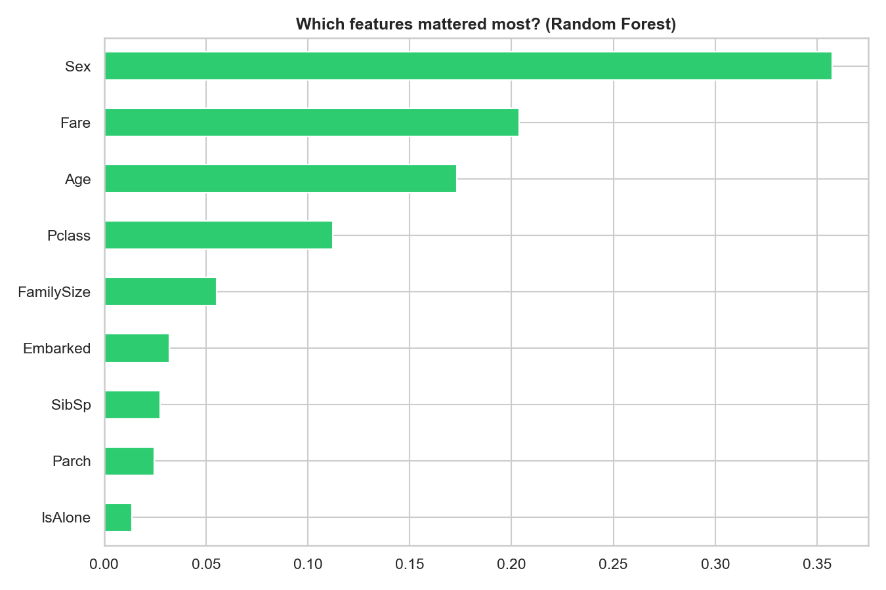

# 🚢 Titanic Survival Prediction

An end-to-end Machine Learning project that predicts whether a passenger survived the Titanic disaster using historical passenger data. This project covers **Exploratory Data Analysis (EDA), Feature Engineering, Model Training, Evaluation, and Visualization**, while comparing the performance of **Logistic Regression** and **Random Forest Classifier**.

---

## 📊 Results

| Model               | Accuracy  | Status       |
| ------------------- | --------- | ------------ |
| 🏆 Random Forest    | **81.0%** | Best Overall |
| Logistic Regression | **80.4%** | Runner-up    |

Benchmarked using the official Kaggle **Titanic train.csv** dataset (891 passengers) with an **80/20 stratified train-test split**.

---

## 🧠 Key Insights

| Finding                                         | Detail                                                                                                                                 |
| ----------------------------------------------- | -------------------------------------------------------------------------------------------------------------------------------------- |
| **Sex is the #1 predictor**                     | Gender was overwhelmingly the strongest indicator of survival, reflecting the historical "women and children first" evacuation policy. |
| **Fare & Age matter significantly**             | Alongside gender, passenger fare and age emerged as the most influential variables.                                                    |
| **Passenger class impacts survival**            | First-class passengers enjoyed substantially higher survival rates than third-class passengers.                                        |
| **Solo travellers struggled**                   | Passengers travelling alone had lower survival probabilities compared to those travelling with family members.                         |
| **Random Forest edges out Logistic Regression** | Random Forest slightly outperformed Logistic Regression by capturing non-linear relationships more effectively.                        |

---

## 📂 Project Structure

```plaintext
titanic-survival-prediction/
├── titanic_model.py        # Complete ML pipeline
├── train.csv               # Official Kaggle dataset (Required)
├── requirements.txt        # Python dependencies
├── .gitignore
├── LICENSE
├── README.md
└── plots/
    ├── 01_eda.png
    ├── 02_correlation.png
    ├── 03_confusion_matrices.png
    ├── 04_roc_curves.png
    └── 05_feature_importance.png
```

---

# 🚀 Quick Start

## 1️⃣ Clone the Repository

```bash
git clone https://github.com/YOUR_USERNAME/titanic-survival-prediction.git
cd titanic-survival-prediction
```

## 2️⃣ Install Dependencies

```bash
pip install -r requirements.txt
```

## 3️⃣ Download the Dataset

Download the Titanic dataset from Kaggle:

https://www.kaggle.com/datasets/yasserh/titanic-dataset

Place `train.csv` directly inside the project root folder.

## 4️⃣ Run the Model

```bash
python titanic_model.py
```

---

# ⚙️ Pipeline Overview

| Stage                            | Description                                                                                         |
| -------------------------------- | --------------------------------------------------------------------------------------------------- |
| **1. Data Loading**              | Reads the user-provided `train.csv` dataset and validates file availability.                        |
| **2. Exploratory Data Analysis** | Examines survival rates across gender, class, age groups, and embarkation ports.                    |
| **3. Feature Engineering**       | Handles missing values, creates FamilySize and IsAlone features, and encodes categorical variables. |
| **4. Preprocessing**             | Performs train-test split and feature scaling where required.                                       |
| **5. Model Training**            | Trains Logistic Regression and Random Forest models with fixed random seeds for reproducibility.    |
| **6. Evaluation**                | Calculates Accuracy, ROC-AUC, Confusion Matrices, and Feature Importance rankings.                  |

---

# 📈 Visualizations

The script automatically generates and saves five high-quality plots inside the `plots/` directory.

| File                        | Description                                                             |
| --------------------------- | ----------------------------------------------------------------------- |
| `01_eda.png`                | Survival rates by gender, class, age distribution, and embarkation port |
| `02_correlation.png`        | Feature correlation heatmap                                             |
| `03_confusion_matrices.png` | Side-by-side confusion matrices                                         |
| `04_roc_curves.png`         | ROC curve comparison                                                    |
| `05_feature_importance.png` | Random Forest feature importance rankings                               |

---

## Sample Outputs

### Exploratory Data Analysis



### Correlation Heatmap



### Confusion Matrices



### ROC Curves



### Feature Importance



---

# 🛠 Tech Stack

| Library      | Version | Purpose                                |
| ------------ | ------- | -------------------------------------- |
| scikit-learn | ≥ 1.2   | Machine learning models and evaluation |
| pandas       | ≥ 1.5   | Data manipulation and preprocessing    |
| NumPy        | ≥ 1.24  | Numerical computations                 |
| Matplotlib   | ≥ 3.6   | Visualization                          |
| Seaborn      | ≥ 0.12  | Statistical plotting and heatmaps      |

---

# 📌 Future Improvements

* Hyperparameter tuning using GridSearchCV
* Cross-validation benchmarking
* XGBoost and LightGBM integration
* Model deployment using Flask or FastAPI
* Interactive dashboard with Streamlit

---

# 📜 License

MIT License © 2026

---

### ⭐ If you found this project useful, consider giving it a star on GitHub!
